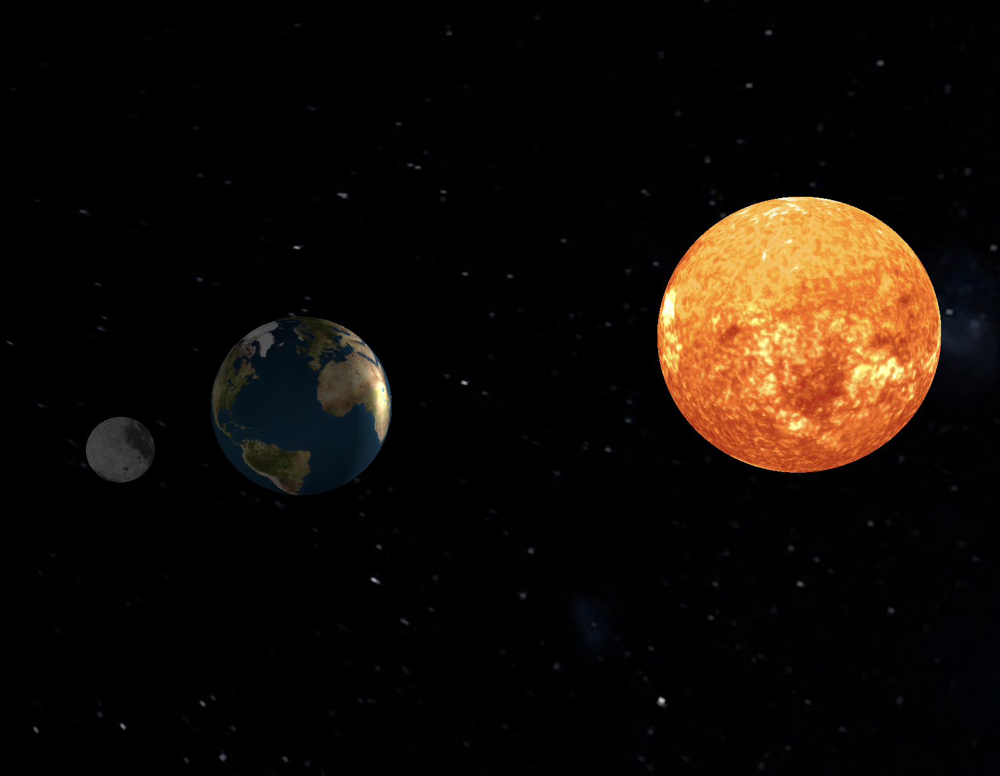
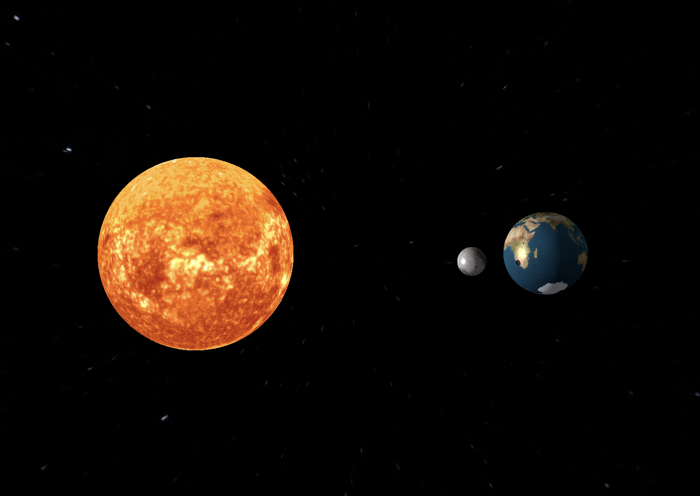
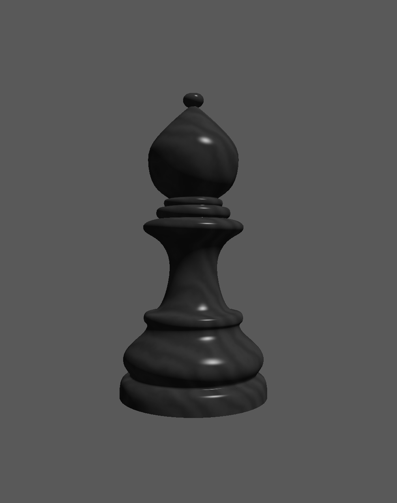
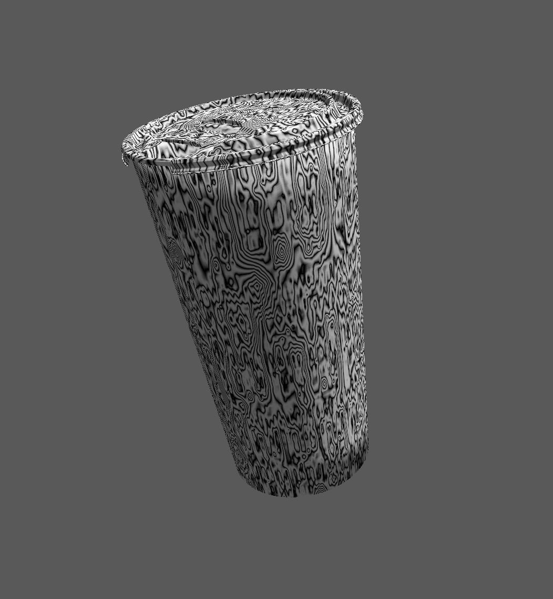
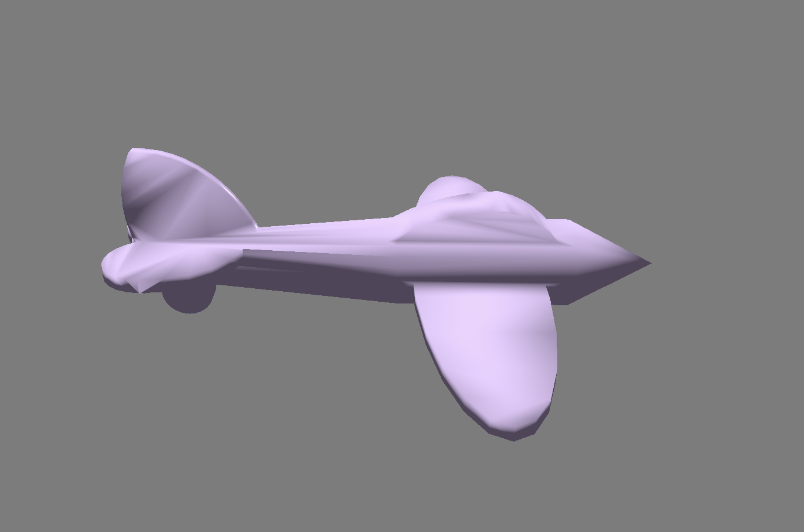
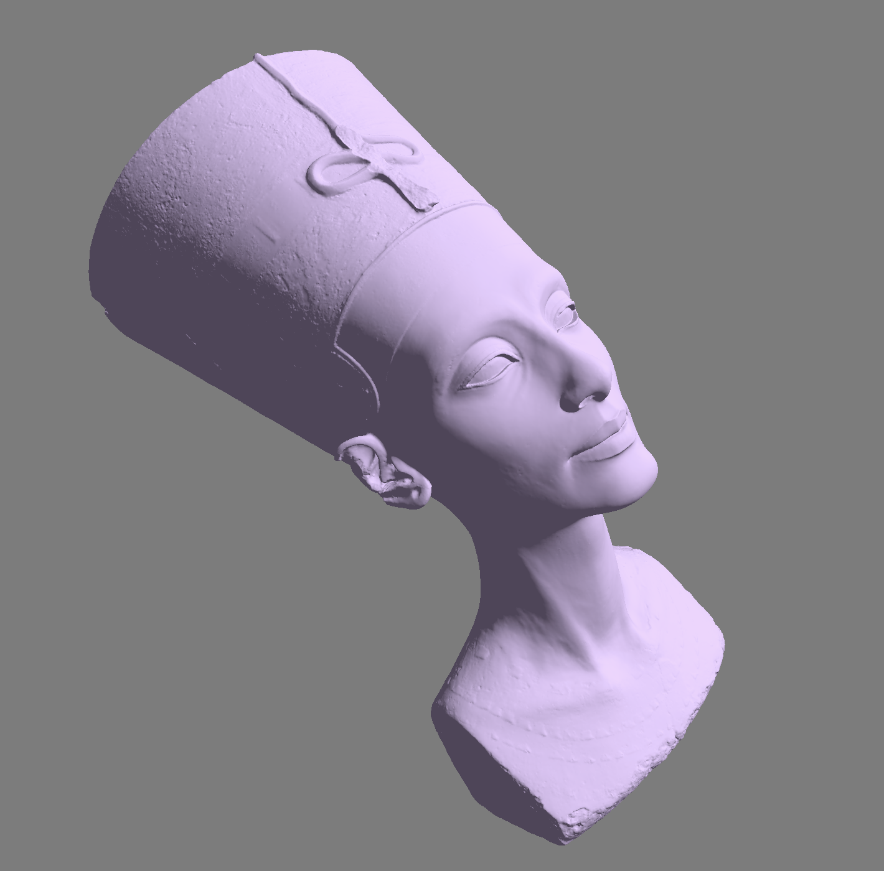

# CPSC-453-Computer-Graphics-Vulkan: Solar System Ray Tracing, Texture Mapping, Rendering 3D Objects

## Setup and Instructions
Install Vulkan on your computer by following the instruction provided in the following repository: [VulkanLaunchpadStarter](https://github.com/cg-tuwien/VulkanLaunchpadStarter).

Then follow the steps below:
1. Clone this repository
2. Go to the project directory
3. Run: mkdir build
3. Run: cd build
4. Run: cmake ..
6. Run: make -j10
7. Further instruction provided in the README.md files located in the respective project directories

## 1. Solar System - HW4:
This project uses the Vulkan API to create a Solar System using Realtime Ray Tracing that has Phong Shading, Shadow Rays and Image Texture Mapping. It contains orbital motions of the Sun, Earth and Moon with a Starry Skybox using transformations, rasterization, texture mapping, lighting and shading, environment mapping, and raytracing. It also contains user controls to interact with the orbital motion of the planet.

### Lighting and Shadow Rays
I used ray tracing to implement the shadow effect. This causes the moon to cast a shadow on the earth during solar eclipse and earth casts shadow on moon during lunar eclipse. In the sphereIntersection() function I shoot the ray back to the ligh source and check if it intersects with any other object. I return a float values depending on if there was an intersection or not. If ther eis an opject in the way I set diffuse and specualar to 0 in order to create a shadow. 

## 2. Texture Mapping - HW3:
This project implements texture mapping using the Vulkan API. It contains texture mapping and lighting using Phong Shading, Ambient Occlusion, Perlin Noise as well as user controls to interact with the different textures.

### Texture Mapping and Lighting:

### Perlin Noise:

## 2. Rendering 3D Objects - HW2:
This project delves into the 3D rendering pipeline, focusing on rendering 3D OBJ models. It includes implementing 3D transformations for modelling, viewing, and perspective projection. It also provide controls to allow the user to interactively change the view and apply transformations to the object. It also contains lighting and shading calculations as well as programming vertex and fragment shaders within the Vulkan framework.

